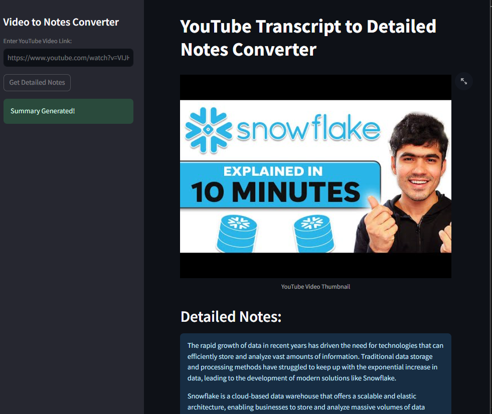

# YouTube Transcript Summarizer

This repository contains a Streamlit web application that serves as a YouTube video transcript summarizer. The application utilizes the Google Gemini Pro API and the YouTube Transcript API to generate concise and informative summaries of provided video transcripts.

## Features

- **YouTube Video Link Input**: Users can input a YouTube video link in the sidebar to get detailed notes.
- **Transcript Extraction**: The application extracts the transcript text from the provided YouTube video link using the YouTube Transcript API.
- **Summary Generation**: The Google Gemini Pro API is employed to generate a summary of the extracted transcript within 250 words.
- **User Interface**: The Streamlit app provides an interactive and user-friendly interface, allowing users to easily obtain detailed notes for a given YouTube video.

## Some of the Project ScreenShot:
   

## Getting Started

Follow these steps to set up and run the YouTube Transcript Summarizer:

1. Clone the repository to your local machine:
   
   git clone https://github.com/your_username/your_repository.git

2. Install the required dependencies:
   
   pip install -r requirements.txt

3. Set up your Google API key and ensure it's stored as an environment variable named "GOOGLE_API_KEY". 

4. Run the Streamlit app:

   streamlit run app.py

## Usage

1. Input a valid YouTube video link in the sidebar.
2. Click the "Get Detailed Notes" button to extract the transcript    and generate a summary.
3. The detailed notes and summary will be displayed in the main content area.

## Dependencies
  
  - Streamlit
  - Google-genrativeaAI
  - youtube_transcript_api

## Notes

Make sure to comply with the terms of use of the respective APIs and services integrated into this application.

Feel free to explore and enhance the functionality of the YouTube Transcript Summarizer! If you encounter any issues or have suggestions, please create an issue or pull request.

Happy summarizing!